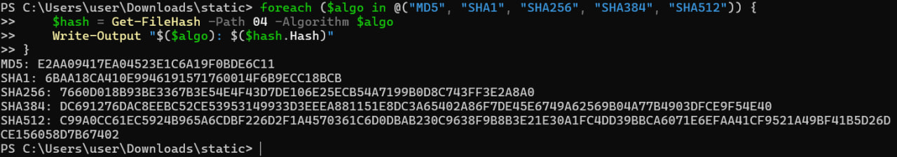
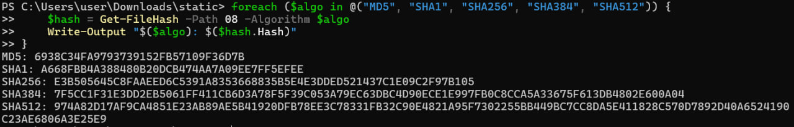

# KhasanovaUN135

Файлы: 04, 08

1) Контрольные суммы файлов 

Команда: 
```
foreach ($algo in @("MD5", "SHA1", "SHA256", "SHA384", "SHA512")) {
    $hash = Get-FileHash -Path $filePath -Algorithm $algo
    Write-Output "$($algo): $($hash.Hash)"
}
```

Результат: 
- 04: 

- 08: 
