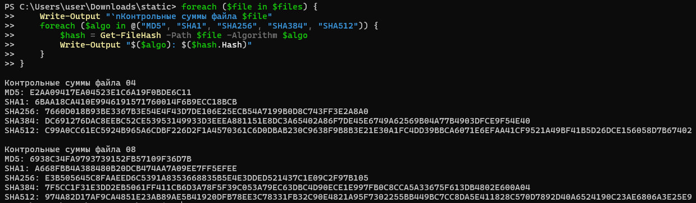

# KhasanovaUN135

Файлы: 04, 08

1) Контрольные суммы файлов 

Команда: 
```
$files = @("04", "08")

foreach ($file in $files) {
    Write-Output "`nКонтрольные суммы файла $file ==="
    foreach ($algo in @("MD5", "SHA1", "SHA256", "SHA384", "SHA512")) {
        $hash = Get-FileHash -Path $file -Algorithm $algo
        Write-Output "$($algo): $($hash.Hash)"
    }
}
```

Результат: 
