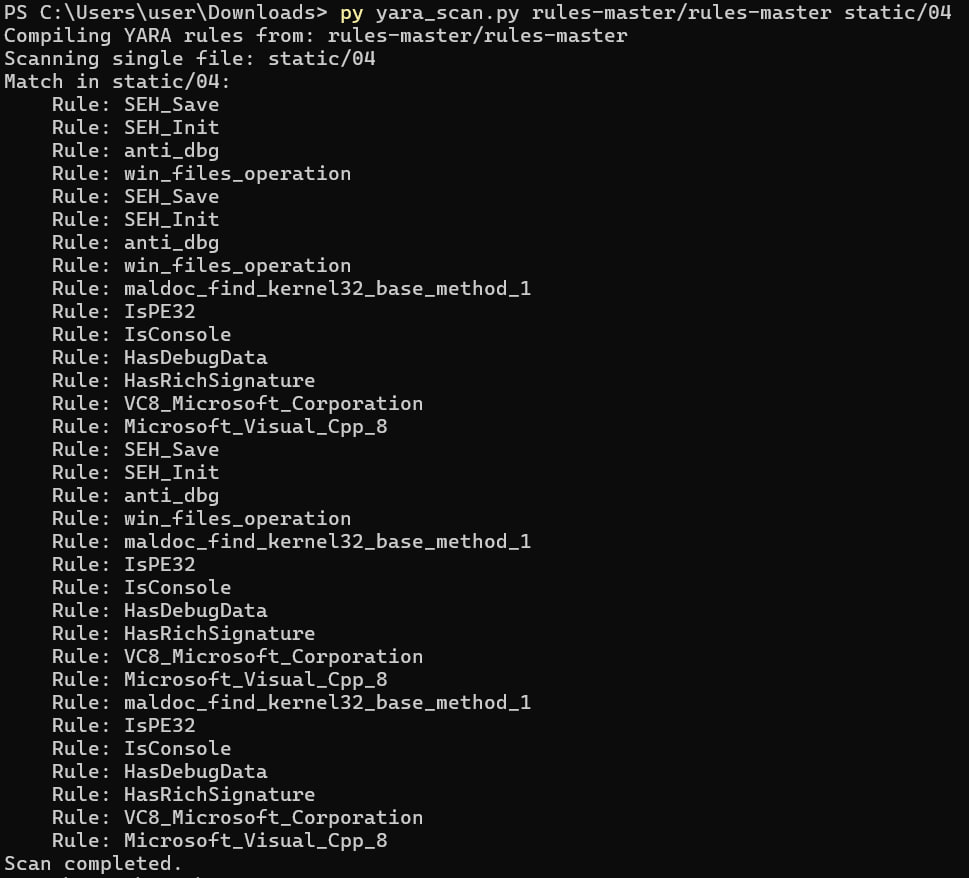
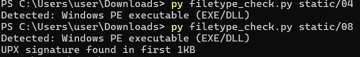

# KhasanovaUN135

Файлы: 04, 08

1) Контрольные суммы файлов 

Команда: 
```
$files = @("04", "08")

foreach ($file in $files) {
    Write-Output "`nКонтрольные суммы файла $file ==="
    foreach ($algo in @("MD5", "SHA1", "SHA256", "SHA384", "SHA512")) {
        $hash = Get-FileHash -Path $file -Algorithm $algo
        Write-Output "$($algo): $($hash.Hash)"
    }
}
```

Результат: 


2) Детектирование файла

для детектирования были использованы YARA-правила [отсюда](https://github.com/YARA-Rules/rules?tab=readme-ov-file#packers)
каждое из них применялось к файлам с помощью python-скрипта

2.1. Результаты для файла 04


На основании результатов YARA-сканирования можно сделать однозначный вывод: файл static/04 — это исполняемый Windows-файл (PE32), который содержит характерные признаки вредоносного ПО (malware).

🔍 Основные признаки:
1. Антиотладочные техники
Сработали правила:

SEH_Save, SEH_Init — манипуляции с Structured Exception Handling для обхода отладчиков.
anti_dbg — содержит вызов IsDebuggerPresent из KERNEL32.dll, что прямо указывает на проверку наличия отладчика.
Также использованы строки d5, d%, d0, которые являются обфусцированными сигнатурами известных anti-debug шаблонов.
Эти приёмы почти никогда не используются легитимными программами, особенно в сочетании.

2. Работа с файловой системой
Правило win_files_operation сработало на API:

CreateFileA, ReadFile, WriteFile, SetFilePointer, FindClose
→ Программа читает/пишет файлы, что нормально для мальвара (например, для персистентности, кражи данных, самоизвлечения).

3. Способы разрешения API вручную
Правило maldoc_find_kernel32_base_method_1 (от Didier Stevens) срабатывает, когда код вручную парсит PE-заголовки, чтобы найти KERNEL32.dll и разрешить адреса API без использования импорта.

→ Это типичный приём шеллкодов и стейджеров, чтобы избежать статического анализа.

4. Отладочная информация и Rich-сигнатура
HasDebugData — в PE-файле есть отладочные секции (.debug).
HasRichSignature + Microsoft_Visual_Cpp_8 — скомпилирован в Visual Studio 2005–2008.
Легитимные коммерческие программы очищают отладочные данные перед релизом. Их наличие в wild — сильный индикатор подозрительности.

5. Тип файла
IsPE32 — 32-битный Windows-исполняемый файл (.exe, .dll, или упакованный бинарник).
IsConsole — приложение с консольным интерфейсом (не GUI).
⚠️ Вывод:
Файл static/04 — это, с высокой вероятностью, образец вредоносного ПО, возможно:

стейджер (загрузчик второго этапа),
инжектор,
шеллкод-обёртка,
или тестовый пейлоад для red team / эксплуатации.
Он использует антианализные техники (anti-debug, ручной поиск API), что указывает на намеренное сокрытие поведения.


2.1. Результаты для файла 08


Файл static/08 — это упакованный исполняемый файл Windows (PE32), почти наверняка — вредоносный или подозрительный, и вот по каким признакам:

🔍 Ключевые признаки из YARA-сканирования:
1. Упакован упаковщиком UPX
Сработали правила:
UPX
UPXV200V290MarkusOberhumerLaszloMolnarJohnReiser
Это указывает на то, что файл сжат с помощью популярного open-source упаковщика UPX (Ultimate Packer for eXecutables).
Хотя UPX легален, вредоносные программы часто используют его, чтобы:
затруднить статический анализ,
обойти антивирусы (хотя современные AV легко распаковывают UPX).
2. Обнаружены признаки других упаковщиков/протекторов
Правило: yodas_Protector_v1033_dllocx_Ashkbiz_Danehkar_h
Указывает на Yoda’s Protector — коммерческий или полуобфусцирующий протектор, часто используемый в мальваре или crack-софте.
Правило: suspicious_packer_section
Обнаружены секции с подозрительными именами (например, .upx, .yP, .packed и т.п.), нехарактерные для обычных программ.
3. Файл помечен как упакованный и аномальный
IsPacked — подтверждает упаковку.
IsBeyondImageSize — сигнализирует, что данные в PE-файле выходят за пределы объявленного размера образа, что типично для:
ручной упаковки,
переполнения секций,
попыток обхода анализаторов.
4. Присутствует Rich-подпись и PE32-заголовок
IsPE32, HasRichSignature — это обычный Windows-исполняемый файл (32-битный), собранный MSVC.
Сам по себе — не вредоносный признак, но в сочетании с упаковкой — тревожный.
5. Обнаружена техника получения EIP (указателя инструкций)
Правило: maldoc_getEIP_method_1 (от Didier Stevens)
Срабатывает на shellcode или позиционно-независимый код (PIC), который получает собственный адрес в памяти через CALL/POP.
Это типично для эксплойтов, шеллкодов, стейджеров и позиционно-независимых мальвар-компонентов.
6. Консольное приложение (IsConsole)
Может быть скриптом, лоадером, бэкдором или утилитой командной строки (в т.ч. вредоносной).
⚠️ Вывод:
Файл static/08 — это упакованный 32-битный Windows-исполняемый файл, использующий как минимум UPX и, возможно, Yoda's Protector. Он содержит код, использующий техники PIC (shellcode-style) и проявляет аномалии в структуре PE, характерные для:

Вредоносных программ (трояны, стейджеры, дропперы),
Эксплойт-пейлоадов,
Crack-инструментов или пиратского софта (редко — легитимное ПО, но маловероятно в контексте maldoc_* правил).
❗ Не запускайте этот файл на основной системе.


3) Формат файла 

с помощью python-скрипта проанализировала некоторые популярные магические сигнатуры

Результат: 



